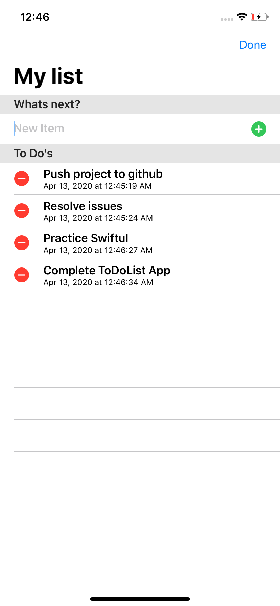

# SwiftUI ToDoList App
 - Core data + swiftUI w/ Brian advent
 - This app uses CoreData to store users list
 - Data is sorted upon date entry
 - user can delete item
 
 # Screenshots
 

 
 
 
 

 

 
